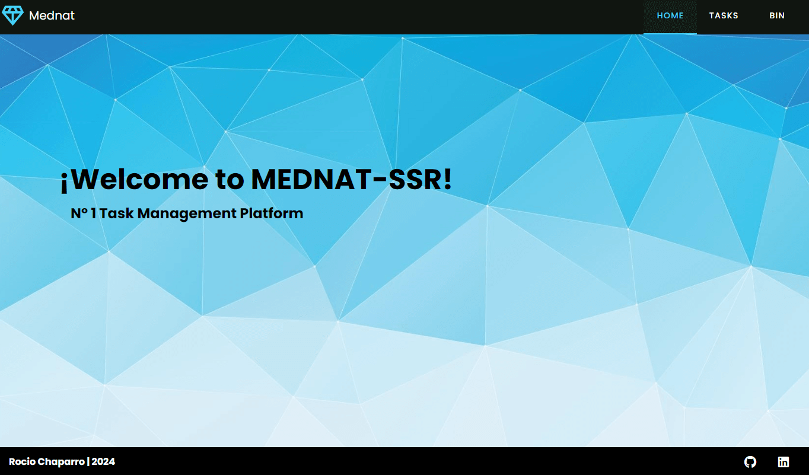
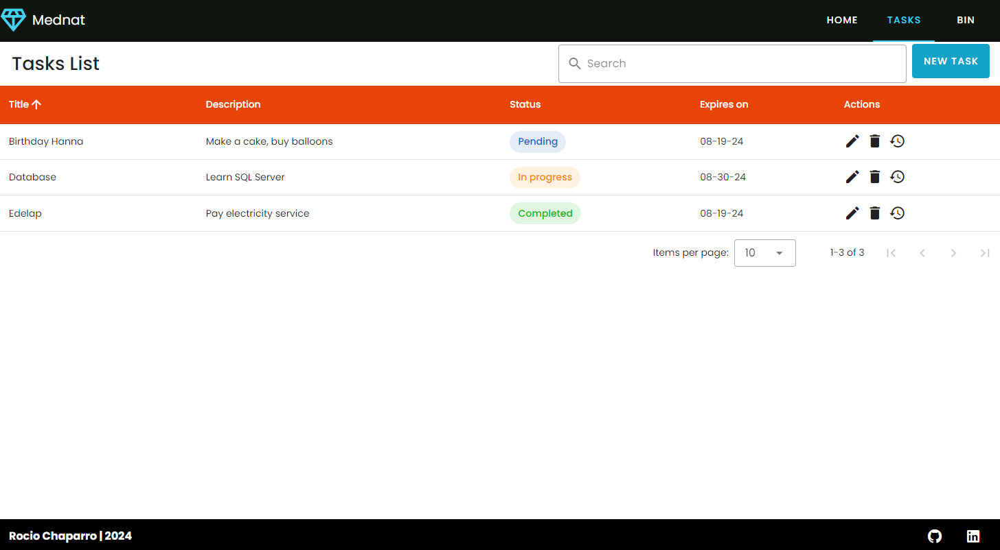
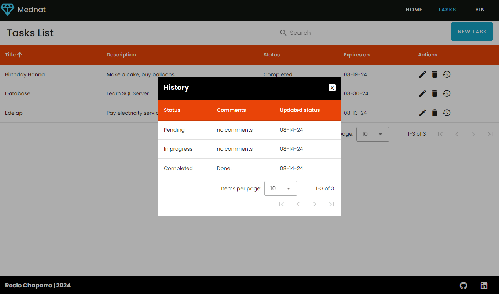
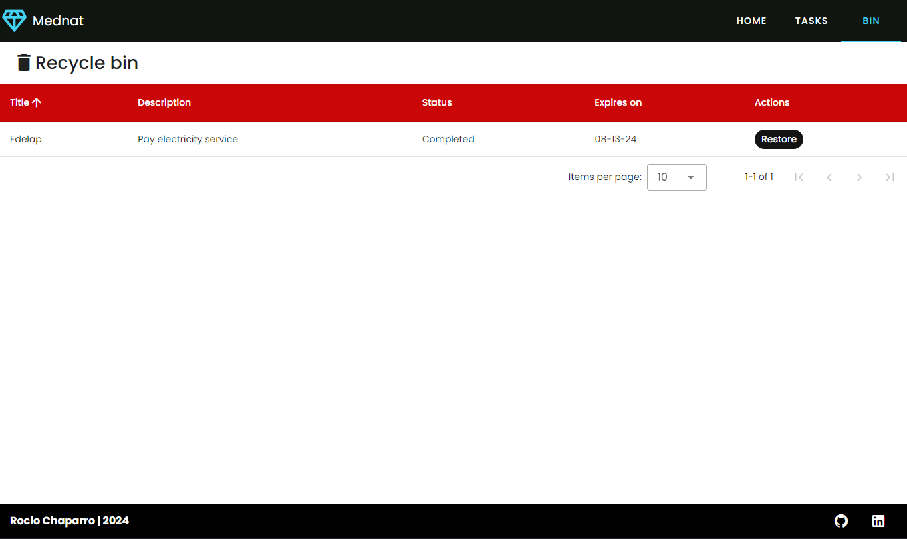
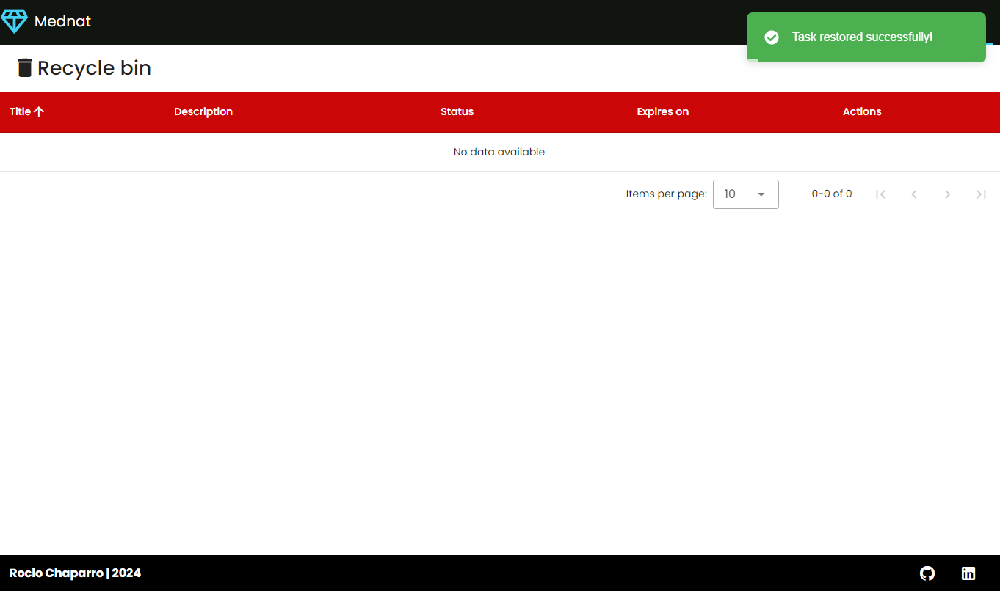

# ***Task Manager:***

##### Realice este proyecto con el fin de evaluar y poner en práctica el desarrollo de una aplicación completa utilizando:
Backend: 
- Node Js
- Express
- SQL Server
- MSSQL
- Cors
- Dotenv
- Nodemon

Frontend:
- Vue 3
- Vuetify
- Vue Router
- Axios 

Con "Task Manager" podremos crear tareas, editarlas, eliminarlas o restaurarlas desde la papelera de reciclaje. Al crear una tarea tendremos los campos titulo, una descripción, un estado y una fecha de vencimiento para poder identificarla. Al editar tendremos la opción de agregar un comentario, en caso de ser necesario, para especificar por que motivo estamos editando dicha tarea.

##### Las carpetas backend y frontend contienen los README.md correspondientes para utilizar la aplicación correctamente. 

### Imágenes del proyecto

Inicio

Tareas

Historial

Papelera

Restaurar Tarea

## ❗️ Links Importantes

- [Vue 3](https://vuejs.org/guide/introduction.html)
- [Vuetify](https://vuetifyjs.com/)
- [Axios](https://axios-http.com/es/docs/intro)
- [SQL Server](https://www.microsoft.com/es-ar/sql-server/sql-server-2022)

## Developer

Rocio Magali Chaparro
